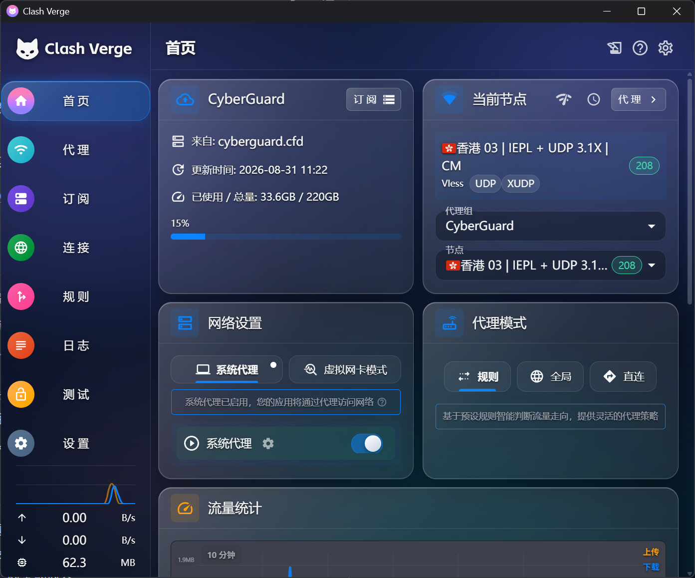
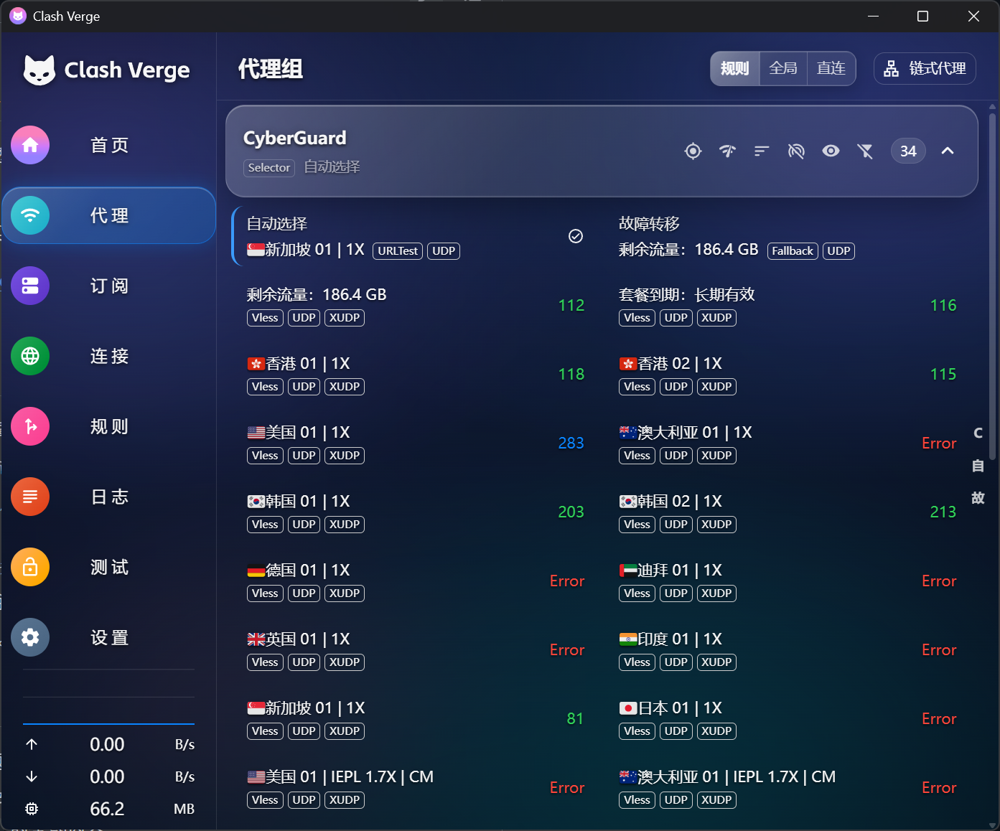
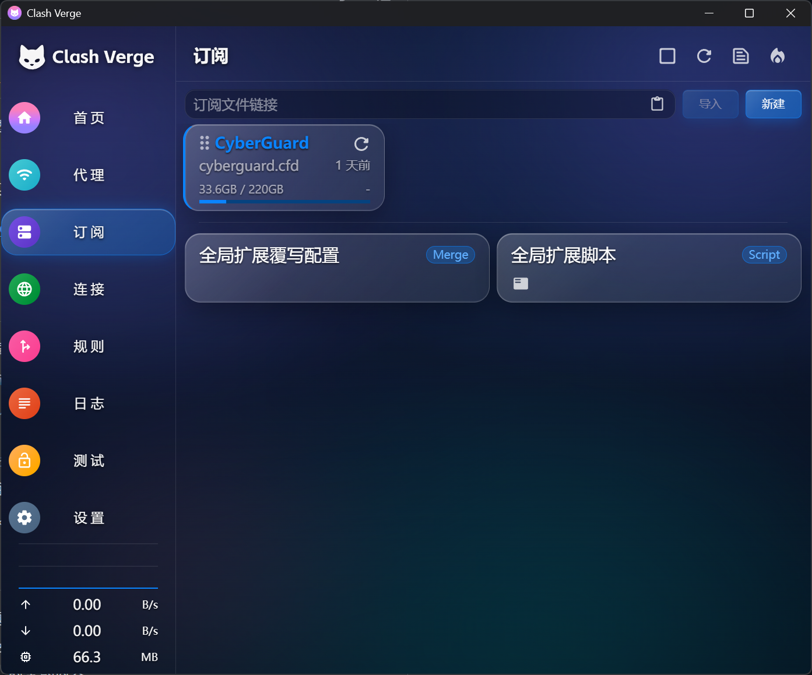
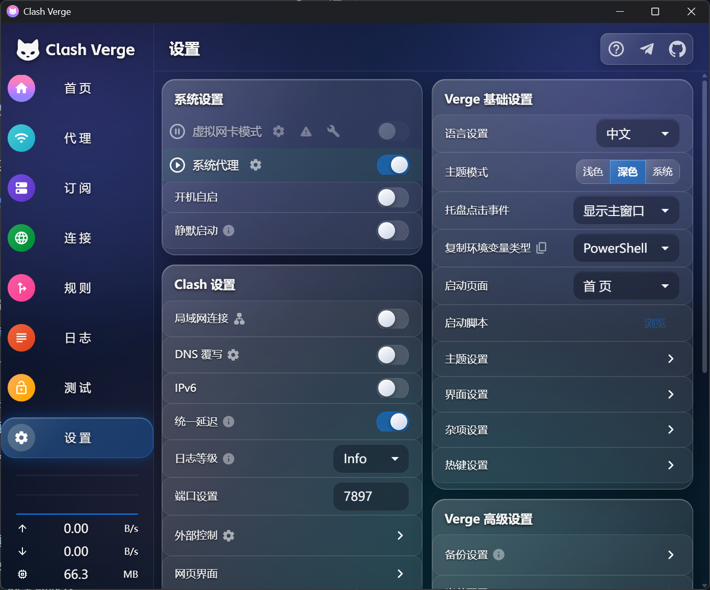

# Clash Verge Rev · 液态玻璃主题 (Liquid Glass)

一套通过 **CSS 注入**（theme.css）实现的液态玻璃风格主题：半透明玻璃面板、对角高光、内发光边缘、背景液态光晕流动，浮层（对话框 / 菜单 / 气泡）使用深度背景模糊。

**首页**|**代理页**
|:--:|:--:|
|
**订阅页**|**设置页**
|

适配 **Clash Verge Rev v2.5.4**，**仅建议在深色模式下使用**。

> 灵感与选择器结构参考了 [camy-x/clash-verge-rev-glass-theme](https://github.com/camy-x/clash-verge-rev-glass-theme)（MIT），在其"磨砂玻璃"分层思路上重做了液态玻璃材质与背景系统。

## 主题特点

- **多层背景**：壁纸层 → 缓慢漂移的液态色斑层 → 全局暗色遮罩层，玻璃面板直接叠在其上。
- **玻璃材质**：半透明染色 + 135° 对角高光渐变 + 顶部内发光描边 + 大圆角（18px）。
- **不依赖逐卡片模糊**：壁纸与色斑在底层预模糊，页面卡片只用半透明染色，避免几十张卡片同时跑 `backdrop-filter` 造成卡顿。
- **浮层单独强化**：对话框、右键菜单、下拉、气泡提示、通知条使用 28px 真实背景模糊 + 饱和度提升。
- **跟随主色**：选中态、按钮强调、焦点环、Chip 等自动读取"主题设置 → 主色"，并带 `color-mix` 兜底。
- **离线可用**：默认壁纸是内置极光渐变，不依赖任何网络图片。

## 安装

1. 进入 **设置 > Verge 基础设置 > 主题模式 >「深色」**。
2. 进入 **设置 > Verge 基础设置 > 主题设置 > CSS 注入 > 编辑 CSS**。
3. 在 CSS 编辑器中 `Ctrl+A` 全选删除旧内容，粘贴 [`theme.css`](theme.css) 的全部内容。
4. 保存 CSS 编辑器，再保存外层主题设置；如未立即刷新，重启应用。

### 推荐配色

在"主题设置"里把主色改成与玻璃材质呼应的颜色（其余颜色留空走默认即可）：

```text
主色: #5AB0F8
次色: #F58BA6
信息色: #7FC8FF
警告色: #F5B45C
错误色: #FF6B80
成功色: #3FD3A8
```

不修改主色也可以，主题会跟随当前主色自动生成选中态光晕与强调色。

## 更换背景

### 使用网络图片

编辑 `theme.css` 顶部变量区：

```css
--lg-wallpaper: url("https://example.com/wallpaper.jpg");
```

### 使用本地图片（Windows）

本地路径不能直接写 `C:\...`，需转换为 `asset.localhost` 地址。在 PowerShell 中执行：

```powershell
$picturePath = 'D:\下载\我的壁纸.jpg'
'http://asset.localhost/' + [uri]::EscapeDataString($picturePath)
```

把输出的地址填入：

```css
--lg-wallpaper: url("这里粘贴 PowerShell 输出的地址");
```

### 调整明暗与玻璃感

| 变量 | 作用 | 建议 |
| --- | --- | --- |
| `--lg-scrim-top` / `--lg-scrim-bottom` | 全局暗色遮罩，越大越暗 | 明亮壁纸 `0.45 ~ 0.65`；暗色壁纸 `0.25 ~ 0.4` |
| `--lg-wp-blur` | 壁纸模糊半径 | 想要更强磨砂感可试 `2px ~ 10px` |
| `--lg-blob-opacity` | 液态色斑透明度 | 不喜欢流动光晕设为 `0` |
| `--lg-blob-motion` | 色斑流动周期 | `44s`；改小更明显 |
| `--lg-tint` / `--lg-tint-strong` | 玻璃面板染色浓度 | 背景太花可加大到 `0.1 ~ 0.16` |
| `--lg-radius` | 玻璃圆角 | 默认 `18px` |
| `--lg-overlay-blur` | 浮层背景模糊 | 默认 `28px` |

系统开启"减少动态效果"时，色斑流动与过渡动画会自动关闭。

## 兼容性说明

- 依赖 Chromium `:has()`、`color-mix()`（WebView2 均已支持）。
- CSS 中包含 `@keyframes`（液态色斑动画），因此注入时按原始 CSS 生效、不走 `@scope` 包裹；主题所有选择器都只针对应用自身的 MUI 类名与布局类名，不会影响 Monaco 编辑器。
- 应用升级后若页面结构变化，个别选择器可能需要重新适配。
- 本主题不是 Clash Verge Rev 官方主题。
# Clash Verge Rev · 液态玻璃主题 (Liquid Glass)

一套通过 **CSS 注入**（theme.css）实现的液态玻璃风格主题：半透明玻璃面板、对角高光、内发光边缘、背景液态光晕流动，浮层（对话框 / 菜单 / 气泡）使用深度背景模糊。

适配 **Clash Verge Rev v2.5.x**（本仓库 v2.5.4），**仅建议在深色模式下使用**。

> 灵感与选择器结构参考了 [camy-x/clash-verge-rev-glass-theme](https://github.com/camy-x/clash-verge-rev-glass-theme)（MIT），在其"磨砂玻璃"分层思路上重做了液态玻璃材质与背景系统。

## 主题特点

- **多层背景**：壁纸层 → 缓慢漂移的液态色斑层 → 全局暗色遮罩层，玻璃面板直接叠在其上。
- **玻璃材质**：半透明染色 + 135° 对角高光渐变 + 顶部内发光描边 + 大圆角（18px）。
- **不依赖逐卡片模糊**：壁纸与色斑在底层预模糊，页面卡片只用半透明染色，避免几十张卡片同时跑 `backdrop-filter` 造成卡顿。
- **浮层单独强化**：对话框、右键菜单、下拉、气泡提示、通知条使用 28px 真实背景模糊 + 饱和度提升。
- **跟随主色**：选中态、按钮强调、焦点环、Chip 等自动读取"主题设置 → 主色"，并带 `color-mix` 兜底。
- **离线可用**：默认壁纸是内置极光渐变，不依赖任何网络图片。

## 安装

1. 打开 Clash Verge Rev，进入 **设置 → Verge 基础设置 → 主题设置 → CSS 注入 → 编辑 CSS**。
2. 将 **主题模式切换为「深色」**（本主题按深色模式设计，浅色下不可读）。
3. 在 CSS 编辑器中 `Ctrl+A` 全选删除旧内容，粘贴 [`theme.css`](theme.css) 的全部内容。
4. 保存 CSS 编辑器，再保存外层主题设置；如未立即刷新，重启应用。

### 推荐配色

在"主题设置"里把主色改成与玻璃材质呼应的颜色（其余颜色留空走默认即可）：

```text
主色: #5AB0F8
次色: #F58BA6
信息色: #7FC8FF
警告色: #F5B45C
错误色: #FF6B80
成功色: #3FD3A8
```

不修改主色也可以，主题会跟随当前主色自动生成选中态光晕与强调色。

## 更换背景

### 使用网络图片

编辑 `theme.css` 顶部变量区：

```css
--lg-wallpaper: url("https://example.com/wallpaper.jpg");
```

### 使用本地图片（Windows）

本地路径不能直接写 `C:\...`，需转换为 `asset.localhost` 地址。在 PowerShell 中执行：

```powershell
$picturePath = 'D:\下载\我的壁纸.jpg'
'http://asset.localhost/' + [uri]::EscapeDataString($picturePath)
```

把输出的地址填入：

```css
--lg-wallpaper: url("这里粘贴 PowerShell 输出的地址");
```

### 调整明暗与玻璃感

| 变量 | 作用 | 建议 |
| --- | --- | --- |
| `--lg-scrim-top` / `--lg-scrim-bottom` | 全局暗色遮罩，越大越暗 | 明亮壁纸 `0.45 ~ 0.65`；暗色壁纸 `0.25 ~ 0.4` |
| `--lg-wp-blur` | 壁纸模糊半径 | 想要更强磨砂感可试 `2px ~ 10px` |
| `--lg-blob-opacity` | 液态色斑透明度 | 不喜欢流动光晕设为 `0` |
| `--lg-blob-motion` | 色斑流动周期 | `44s`；改小更明显 |
| `--lg-tint` / `--lg-tint-strong` | 玻璃面板染色浓度 | 背景太花可加大到 `0.1 ~ 0.16` |
| `--lg-radius` | 玻璃圆角 | 默认 `18px` |
| `--lg-overlay-blur` | 浮层背景模糊 | 默认 `28px` |

系统开启"减少动态效果"时，色斑流动与过渡动画会自动关闭。

## 兼容性说明

- 依赖 Chromium `:has()`、`color-mix()`（WebView2 均已支持）。
- CSS 中包含 `@keyframes`（液态色斑动画），因此注入时按原始 CSS 生效、不走 `@scope` 包裹；主题所有选择器都只针对应用自身的 MUI 类名与布局类名，不会影响 Monaco 编辑器。
- 应用升级后若页面结构变化，个别选择器可能需要重新适配。
- 本主题不是 Clash Verge Rev 官方主题。
